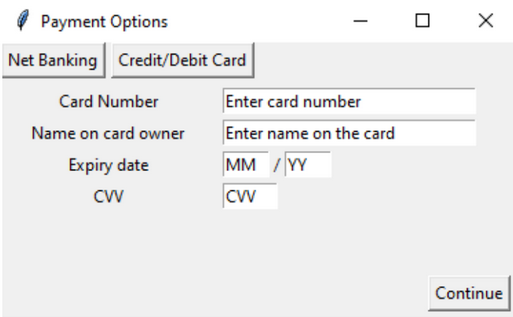

# Movie-Ticket-Booking-System
Creation of a database storing all relevant movie details and a GUI allowing the user to interact with said database to book movie tickets and peripherals.
 

# Modules Used
- tkinter
- PIL
- Random
- ctypes
- mysql.connector

# Prerequisites
- Python v3.9
- MySQL v8.0
- A Windows Machine
 

# Screenshots of Windows

  
  
  
  
  

  
  
  
 

